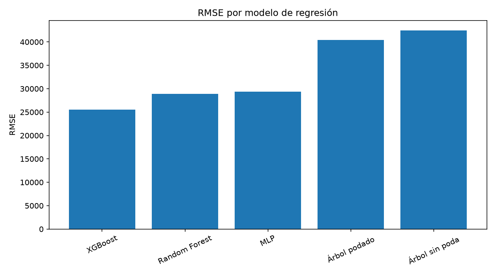
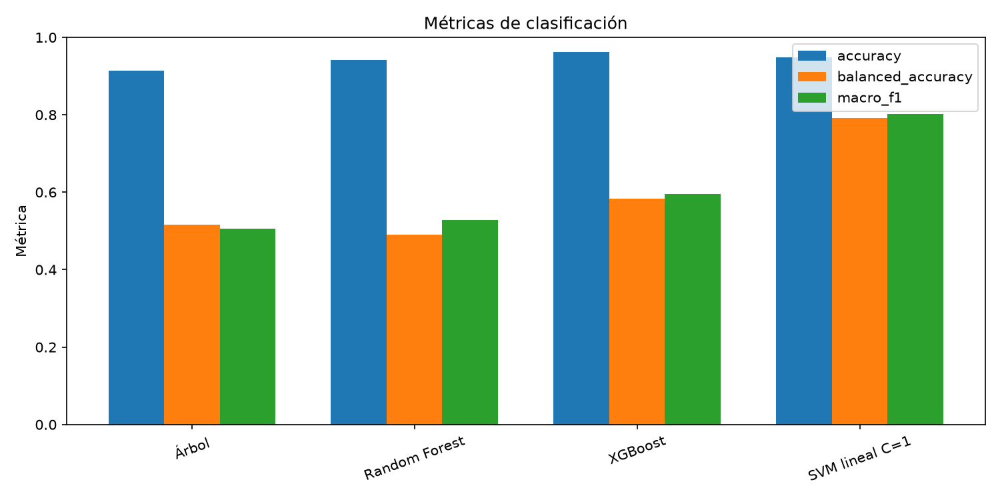
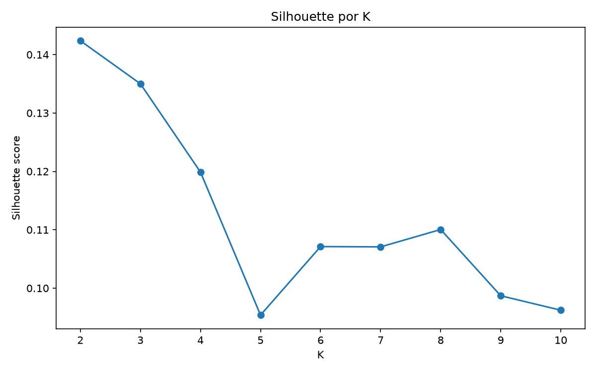
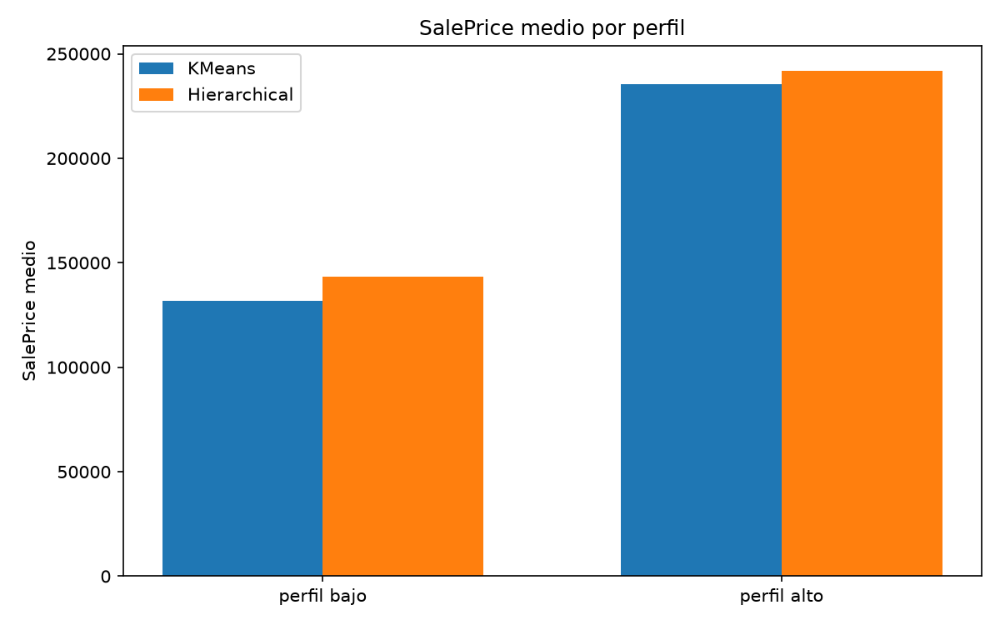
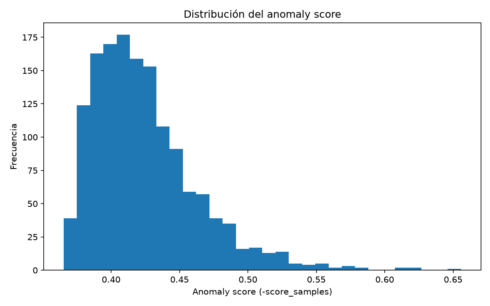
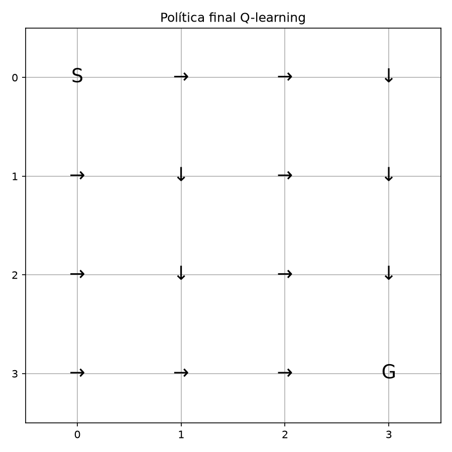
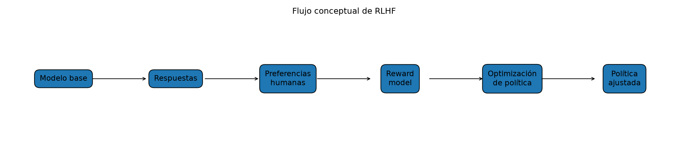

# Actividad 2 - Laboratorio: Modelos Supervisados Avanzados y Aprendizaje No Supervisado

## 1. Introducción

Esta actividad estudia un conjunto de viviendas mediante varias perspectivas de aprendizaje automático. Se combinan análisis exploratorio, tratamiento de valores faltantes, modelos supervisados de regresión y clasificación, métodos no supervisados, detección de anomalías y una introducción pedagógica al aprendizaje por refuerzo. El propósito no es declarar un algoritmo universalmente superior, sino relacionar el algoritmo, el objetivo y la métrica con las características del problema.

El dataset corresponde a viviendas residenciales de Estados Unidos. La variable `SalePrice` se utiliza como objetivo en regresión y como base para construir grupos de precio en clasificación. En clustering y detección de anomalías se excluye deliberadamente para evitar leakage y para distinguir estructura física de precio. Todos los resultados reportados provienen de los artefactos versionados del repositorio.

## 2. Dataset y metodología

El dataset contiene 1460 observaciones y 81 columnas. El target de regresión es `SalePrice`. Para clasificación se definieron tres grupos: grupo1 si `SalePrice <= 100000`, grupo2 entre 100001 y 500000, y grupo3 si `SalePrice >= 500001`. La distribución es grupo1=123 (8.42%), grupo2=1328 (90.96%) y grupo3=9 (0.62%). El desbalance es central para interpretar las métricas.

En los modelos supervisados se mantuvo el split estratificado fijo del Paso 13: 1168 observaciones de entrenamiento y 292 de prueba. El preprocesamiento se incorporó a pipelines y se ajustó solo con entrenamiento: medianas para numéricas, reglas específicas cuando correspondía y codificación one-hot para categóricas. Para SVM se agregó estandarización numérica.

Para clustering se usaron 36 variables numéricas estructurales, excluyendo `Id`, `SalePrice` y `PriceGroup`, con imputación por mediana y `StandardScaler` sobre las 1460 viviendas. Para Isolation Forest se mantuvieron las mismas variables e imputación, pero sin escalado en el modelo principal, porque sus particiones aleatorias no dependen de la distancia euclidiana como K-Means o SVM. Q-learning y RLHF se abordaron como ejercicios didácticos independientes.

## 3. Análisis exploratorio de datos

`SalePrice` presenta mínimo 34900, media 180921.20, mediana 163000 y máximo 755000, con asimetría aproximada de 1.88. La distribución sesgada justifica informar varias métricas y no reducir el análisis a un promedio.

Las variables con mayor relación observada con el precio fueron `OverallQual`, `GrLivArea`, `GarageCars`, `GarageArea`, `TotalBsmtSF` y `1stFlrSF`. También se observaron relaciones de redundancia o multicolinealidad entre `GarageCars/GarageArea`, `YearBuilt/GarageYrBlt`, `GrLivArea/TotRmsAbvGrd` y `TotalBsmtSF/1stFlrSF`. Estas relaciones ayudan a interpretar los modelos, pero no se convierten automáticamente en causalidad.

El dataset contiene 43 variables categóricas. Entre las de mayor cardinalidad se encontraron `Neighborhood` con 25 categorías, `Exterior2nd` con 16, `Exterior1st` con 15, `Condition1` con 9 y `SaleType` con 9. También se identificaron variables muy concentradas en una sola categoría, como `Utilities`, `Street`, `Condition2` y `Heating`. Este análisis permitió identificar categorías poco frecuentes y anticipar la necesidad de una codificación robusta para variables categóricas.

## 4. Tratamiento de valores faltantes

Se distinguió entre missing real y ausencia estructural. Por ejemplo, la ausencia de garaje o de una característica de sótano puede representar que esa estructura no existe, mientras que otros campos requieren imputación estadística. Las estrategias principales fueron: `LotFrontage` por mediana, `MasVnrArea` y `GarageYrBlt` con 0 cuando la ausencia representa inexistencia, `Electrical` por moda y categorías estructurales como `None`.

El conteo inicial fue de 7829 valores faltantes y el resultado imputado no presentó missing. Para el modelado supervisado, los transformadores se ajustaron solo con `X_train`. El archivo completamente imputado se conserva como evidencia, pero no se utilizó como entrada directa para entrenar modelos; esta separación evita que información del test influya en el ajuste.

## 5. Modelos de regresión

La regresión estima `SalePrice` como variable continua. Se evaluaron árbol sin poda, árbol podado, Random Forest, XGBoost y una red MLP. La tabla resume el conjunto de prueba.

| Modelo | RMSE | MAE | R² |
|---|---:|---:|---:|
| Árbol sin poda | 42453.07 | 27494.58 | 0.7650 |
| Árbol podado | 40386.27 | 25776.51 | 0.7874 |
| Random Forest | 28929.45 | 17410.11 | 0.8909 |
| MLP | 29390.27 | 17913.03 | 0.8874 |
| XGBoost | 25564.80 | 15852.43 | 0.9148 |

### 5.1 Árbol de decisión

El árbol sin poda fue interpretable, pero mostró sobreajuste: obtuvo RMSE de entrenamiento 0 y RMSE de test 42453.07. La estructura creció hasta 2245 nodos, reflejando su capacidad para memorizar el entrenamiento.

### 5.2 Poda

La poda seleccionó el parámetro de complejidad usando una validación interna, sin utilizar el test. El árbol podado redujo su complejidad a 127 nodos y mejoró el RMSE de test a 40386.27. La mejora muestra el valor de controlar la varianza, aunque siguió siendo inferior a los ensambles.

### 5.3 Random Forest

Random Forest promedió 300 árboles y redujo considerablemente el error frente a los árboles individuales. Su RMSE fue 28929.45, MAE 17410.11 y R² 0.8909. El ensamble es menos interpretable que un árbol único, pero más robusto frente a variaciones de la muestra.

### 5.4 XGBoost

XGBoost utilizó 500 estimadores, profundidad máxima 3, learning rate 0.03, subsample 0.8 y colsample 0.8. Obtuvo el menor RMSE y el mayor R² del experimento: aproximadamente 25565 dólares de RMSE y R² 0.9148. Este valor es una métrica promedio del conjunto de prueba, no una garantía de error para cada vivienda.

### 5.5 Red neuronal MLP

La MLP utilizó capas Dense de 128, 64 y 32 unidades, activación ReLU y salida lineal, con Adam y early stopping. Durante el entrenamiento, el error se propagó desde la salida hacia las capas anteriores mediante backpropagation, y el optimizador Adam utilizó los gradientes resultantes para actualizar los pesos de la red. Fue competitiva, pero obtuvo RMSE 29390.27 y R² 0.8874, ligeramente por debajo de Random Forest en este split.

### 5.6 Comparación final de regresión

XGBoost fue el mejor modelo de regresión bajo la configuración y split evaluados. La conclusión es contextual: cambiar datos, partición, transformaciones o hiperparámetros podría cambiar el ranking. La Figura 1 resume el RMSE de los cinco modelos.

## 6. Modelos de clasificación

### 6.1 Definición de grupos

Los grupos de precio están extremadamente desbalanceados. El grupo2 concentra 1328 de 1460 viviendas y el grupo3 solo 9. El test contiene 25 casos de grupo1, 265 de grupo2 y 2 de grupo3. Este soporte determina la interpretación de recall y macro F1.

### 6.2 Árbol de decisión

El árbol obtuvo accuracy 0.9144, balanced accuracy 0.5170 y macro F1 0.5063. Su recall por grupos fue 0.60, 0.9509 y 0 para grupos 1, 2 y 3. La accuracy elevada está dominada por la clase mayoritaria.

### 6.3 Random Forest

Random Forest alcanzó accuracy 0.9418, balanced accuracy 0.4908 y macro F1 0.5280. Mejoró el recall del grupo2 a 0.9925, pero bajó grupo1 a 0.48 y no detectó grupo3. Por ello, su accuracy no representa un desempeño equilibrado.

### 6.4 XGBoost

XGBoost obtuvo la mayor accuracy global, 0.9623, con balanced accuracy 0.5829 y macro F1 0.5960. Sus recalls fueron 0.76, 0.9887 y 0 para los tres grupos. Fue el mejor por accuracy, pero no resolvió la clase extrema.

### 6.5 SVM lineal y RBF

Se evaluaron kernels lineal y RBF con C=0.1, 1 y 10, escalando las variables numéricas. El mejor modelo fue el SVM lineal con C=1: accuracy 0.9486, balanced accuracy 0.7916 y macro F1 0.8015. Sus recalls fueron grupo1=0.92, grupo2=0.9547 y grupo3=0.50.

| Kernel | C | Accuracy | Balanced accuracy | Macro F1 |
|---|---:|---:|---:|---:|
| lineal | 0.1 | 0.9692 | 0.6216 | 0.6153 |
| lineal | 1 | 0.9486 | 0.7916 | 0.8015 |
| lineal | 10 | 0.9212 | 0.7574 | 0.7595 |
| RBF | 0.1 | 0.9075 | 0.3333 | 0.3172 |
| RBF | 1 | 0.9658 | 0.5962 | 0.6049 |
| RBF | 10 | 0.9692 | 0.6096 | 0.6134 |

El aumento de C no produjo una mejora monotónica. En el kernel lineal, C=1 maximizó balanced accuracy y macro F1; C=10 redujo ambas. En RBF, C=0.1 fue insuficiente y C=10 mejoró, pero no alcanzó al lineal C=1 en las métricas prioritarias.

### 6.6 Comparación final de clasificación

| Modelo | Accuracy | Balanced accuracy | Macro F1 |
|---|---:|---:|---:|
| Árbol | 0.9144 | 0.5170 | 0.5063 |
| Random Forest | 0.9418 | 0.4908 | 0.5280 |
| XGBoost | 0.9623 | 0.5829 | 0.5960 |
| SVM lineal C=1 | 0.9486 | 0.7916 | 0.8015 |

XGBoost es primero si el objetivo es accuracy. SVM lineal C=1 es el más equilibrado porque lidera balanced accuracy y macro F1. Grupo3 tiene 7 casos en train y 2 en test; el 50% del SVM equivale a un solo acierto y no es una estimación estable.

## 7. Clustering

### 7.1 Selección de K

Se evaluaron K entre 2 y 10 mediante inertia y silhouette, usando 36 variables numéricas estandarizadas. El codo visual se aproximó a K=3–4, pero la mayor silhouette fue K=2 con 0.1424. Se eligió K=2 por esa métrica y por interpretabilidad, sin forzar tres clusters para reproducir los tres umbrales de precio.

### 7.2 K-Means

K-Means produjo un perfil bajo de 769 viviendas (52.67%) y un perfil alto de 691 (47.33%). El perfil bajo es, en promedio, más antiguo, pequeño y de menor calidad; el alto es más nuevo, grande y de mayor calidad. `SalePrice` no participó en el entrenamiento. Después del ajuste, sus medias fueron 131767.01 y 235623.90, respectivamente.

### 7.3 Clustering jerárquico

Ward produjo un perfil bajo de 904 viviendas y un perfil alto de 556, con silhouette 0.1150. Los labels numéricos se alinearon semánticamente antes de comparar. El perfil alto jerárquico tuvo media de precio 241919.74 y el bajo 143404.39.

### 7.4 Comparación e interpretación

El ARI entre K-Means y Ward fue 0.5735, lo que indica coincidencia parcial. K-Means tuvo mejor silhouette y tamaños más equilibrados; Ward aporta el dendrograma y una lectura jerárquica de las fusiones. Ambos métodos destacaron antigüedad, calidad, tamaño y capacidad de garaje.

En ambos métodos, 122 de 123 viviendas del grupo1 quedaron en el perfil bajo (99.19%) y 9 de 9 del grupo3 en el perfil alto (100%). El grupo2 se repartió entre perfiles, confirmando que ese rango de precio contiene viviendas estructuralmente heterogéneas. La diferencia de precios es descriptiva y no causal.

## 8. Detección de anomalías con Isolation Forest

Isolation Forest se entrenó con las 36 variables estructurales imputadas, sin `SalePrice` ni `Id` y sin escalado en el modelo principal. Con 300 estimadores y `contamination="auto"`, marcó 70 observaciones como anómalas bajo la configuración utilizada, equivalentes al 4.79% de las viviendas. Las variables diferenciadoras principales fueron `GrLivArea`, `TotRmsAbvGrd`, `KitchenAbvGr`, `LotArea`, `1stFlrSF`, `2ndFlrSF`, `TotalBsmtSF`, `LowQualFinSF`, `FullBath` y `BedroomAbvGr`.

Las anomalías presentaron media de `GrLivArea` 2428.74 frente a 1469.47 en casos normales y media de `LotArea` 24131.31 frente a 9831.21. Su `SalePrice` medio fue 265004.71, frente a 176686.77 en normales; esta diferencia solo describe una asociación posterior. Una anomalía no es sinónimo de error ni de fraude.

En fraude financiero, la misma idea podría señalar transacciones inusuales por combinaciones de monto, horario, ubicación, dispositivo o frecuencia, incluso sin etiquetas de fraude. Sería un detector inicial, no una sentencia. La ausencia de ground truth impide calcular precision y recall reales de anomalías en este dataset.

## 9. Reinforcement Learning con Q-learning

Se implementó un Gridworld determinista 4x4 con 16 estados. El estado inicial es la esquina superior izquierda y la meta la esquina inferior derecha. Las acciones son arriba, derecha, abajo e izquierda. Cada paso normal recibe -1 y alcanzar la meta recibe +10. La Q-table tiene forma `(16,4)`.

Con alpha=0.1, gamma=0.95, epsilon inicial 1.0, mínimo 0.05, decay 0.995 y 2000 episodios, el agente aprendió una política mediante epsilon-greedy. La evaluación con epsilon=0 logró 100% de éxito, 6 pasos promedio y recompensa media 5. La trayectoria fue `0 → 4 → 5 → 9 → 13 → 14 → 15`, que corresponde al recorrido mínimo. La estabilización es empírica, no una prueba matemática estricta.

## 10. Reflexión sobre RLHF

RLHF significa Reinforcement Learning from Human Feedback. En Q-learning la recompensa fue completamente diseñada: -1 por paso y +10 en la meta. En RLHF, las personas expresan preferencias sobre respuestas y esas señales pueden utilizarse para entrenar un modelo de recompensa, que después orienta la optimización de una política.

El flujo conceptual es modelo base → respuestas → preferencias humanas → reward model → optimización de política → evaluación. En un sistema generativo, el estado puede representar prompt y conversación, la acción una respuesta y la política el modelo que decide qué producir. RLHF puede ayudar con utilidad y seguimiento de instrucciones, pero introduce sesgos, inconsistencias, coste de anotación, reward hacking y errores del reward model. No se implementó RLHF real en esta actividad.

## 11. Limitaciones

- Se utilizó un único dataset de 1460 viviendas y un único split de evaluación supervisada.
- El tuning fue limitado y no se hizo validación cruzada exhaustiva.
- Grupo3 tiene solo 9 casos, por lo que sus métricas son muy inestables.
- Los valores bajos de silhouette indican separación limitada en clustering.
- No existe ground truth de anomalías; Isolation Forest identifica rareza, no fraude.
- K-Means depende del escalado y supone grupos aproximadamente compactos; Ward depende de distancia y linkage.
- Q-learning usa un entorno pequeño, determinista y artificial.
- RLHF se estudió conceptualmente, sin feedback humano ni reward model real.
- Las asociaciones con `SalePrice` no demuestran causalidad ni garantizan resultados fuera del dataset.

## 12. Conclusiones

La actividad muestra que no existe un único algoritmo superior para todos los objetivos. En regresión, XGBoost obtuvo el menor error y mayor R² bajo el split evaluado. En clasificación, XGBoost lideró accuracy, pero el fuerte desbalance hizo necesario priorizar balanced accuracy y macro F1, métricas en las que SVM lineal C=1 fue más equilibrado.

Los métodos no supervisados permitieron descubrir perfiles estructurales y detectar casos atípicos sin utilizar etiquetas. K-Means fue ligeramente preferible por silhouette y equilibrio de tamaños, aunque la separación fue limitada y el ARI mostró solo coincidencia parcial con Ward. Isolation Forest encontró 70 casos inusuales, sin que ello implique fraude.

Q-learning ilustró cómo una recompensa explícita produce una política eficiente en un entorno discreto. La reflexión sobre RLHF contrastó esa recompensa programada con señales derivadas de preferencias humanas y mostró que una señal aprendida también puede contener sesgos o ser sobreoptimizada.

La elección final debe depender del problema: XGBoost para minimizar error de regresión y maximizar accuracy de clasificación; SVM lineal C=1 cuando el equilibrio entre clases sea prioritario; K-Means para una segmentación operativa simple; y Isolation Forest como alerta exploratoria de casos raros. Bajo los datos, la partición y las configuraciones evaluadas, XGBoost fue la alternativa con menor error de regresión y mayor accuracy de clasificación, mientras que SVM lineal con C=1 mostró el comportamiento más equilibrado entre clases.

## 13. Referencias

El informe utiliza como fuentes internas la guía paso a paso, el README y los artefactos versionados del repositorio. Las referencias se presentan de forma descriptiva porque el proyecto no conserva metadata bibliográfica completa:

- Kaggle. *USA Housing Dataset*. Fuente del conjunto de datos utilizado.
- Scikit-learn documentation. Referencia técnica para árboles, Random Forest, SVM, K-Means, clustering jerárquico e Isolation Forest.
- XGBoost documentation. Referencia técnica para modelos de boosting.
- TensorFlow/Keras documentation. Referencia técnica para la red neuronal MLP.
- Material académico y guía de la Actividad 2.

Los scripts oficiales y las tablas, métricas y figuras completas se encuentran versionados en el repositorio. El notebook `notebooks/Actividad2_Evidencia_Final.ipynb` permite revisar los principales outputs sin reentrenar todos los modelos.
